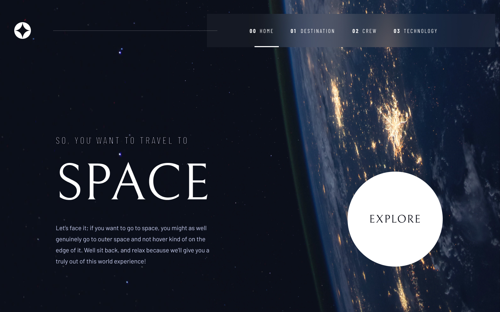

<h1 align='center'>Space tourism multi-page website </h1>

## Índice

- [Visão Geral](#Geral)
  - [Desafio](#Desafio)
  - [Links](#links)
- [Meu processo](#meu-processo)
  - [Ferramentas Utilizadas](#Ferramentas-Utilizadas)
  - [Construindo o Projeto](#construindo-o-projeto)
  - [Recursos Úteis](#recursos-úteis)
- [Contato](#contato)
    - [Avaliação](#avaliação)

## Visão Geral
### Desafio
Seu desafio é construir este site de turismo espacial de várias páginas e fazer com que pareça o mais próximo possível do design.

- Visualize cada página e alterne entre as guias para ver novas informações
- Veja o layout ideal para cada uma das páginas do site dependendo do tamanho da tela do dispositivo
- Veja os estados de foco para todos os elementos interativos na página

### Links 
- [Repositório do Projeto](https://github.com/tatyanepgoncalves/Website-Space/tree/main)
- [Site ativo]()

## Meu processo
### Ferramentas Utilizadas
- HTML
- CSS
- JS

### Construindo o projeto
Minhas etapas do processo de desenvolvimento:

1. Inicializei o projeto como um repositório público no [GitHub](https://github.com/).
2. Configurei o repositório para publicar meu código em um endereço web.
3. Analisei os designs para planejar como colocaria em prática o projeto.
4. Criei a estrutura do projeto em `HTML`.
5. Após a estrutura do HTML criada, comecei adicionar os estilos com ``CSS`.
6. Em seguida, utilizei `JS` para deixar o website dinâmico.

Recursos Úteis

- [W3schools](https://www.w3schools.com/) - Site que usar para buscar dicas de tags e instruções para que consiga o resultado esperado. 
- [MDN Web Docs](https://developer.mozilla.org/pt-BR/) - Site da Mozzila que possui documentação de tecnologias de plataforma Web e que fornece um amplo conjunto de recursos de aprendizagem para desenvolvedores iniciantes. 
- [Font Awesome](https://fontawesome.com/) - Conjunto de ferramentas de fontes e ícones.

## Contato

- Frontend Mentor - [@tatyanepgoncalves](https://www.frontendmentor.io/profile/tatyanepgoncalves)
- GitHub - [@tatyanepgoncalves](https://github.com/tatyanepgoncalves)
- LinkedIn - [@tatyanepgoncalves](https://www.linkedin.com/in/tatyanegoncalves/)

### Avaliação
De uma ⭐ se gostou desse projeto. 